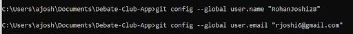
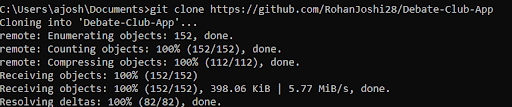
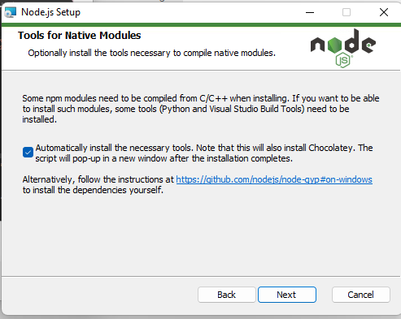
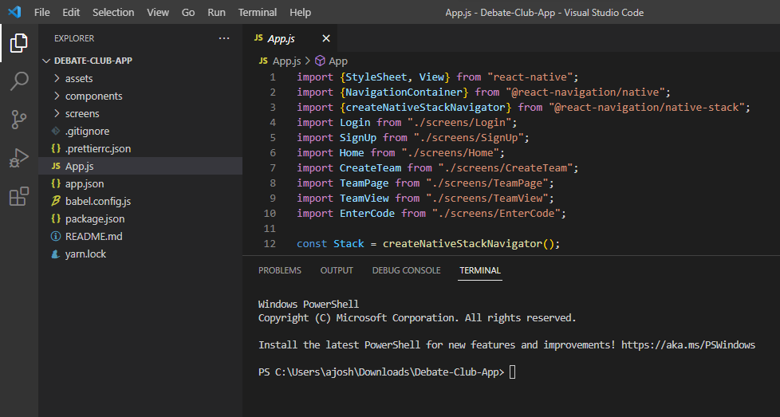
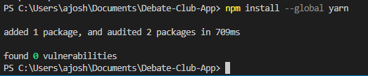
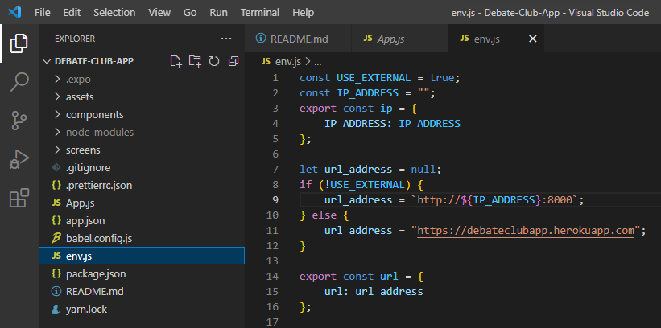
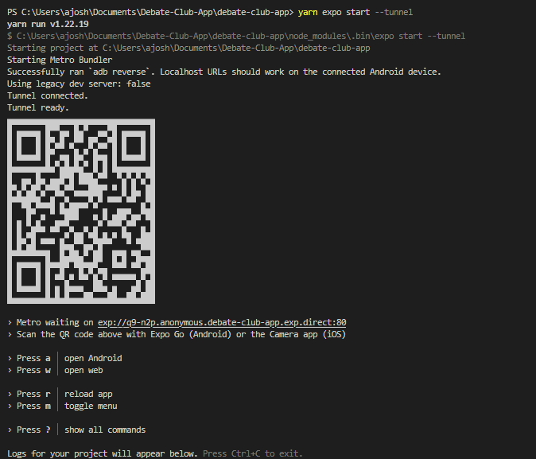
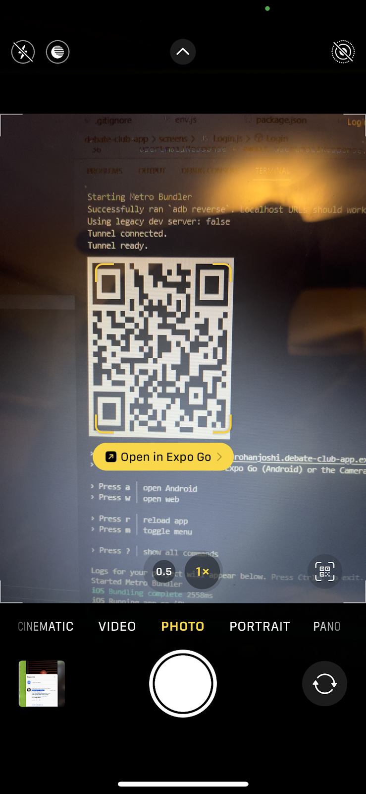

# Debate Team App

Create an app for debate clubs, which include tasks like scheduling, maps of schools, creating match ups, uploading
score sheets, and more.

Created by Joshua Kim and Rohan Joshi

# Installation Guide

For club members, download the VS code editor, in which you can modify your code.
Download the windows, mac, or linux distributions here: https://code.visualstudio.com/download
On windows, double click the exe file and go through the installation wizard.

Open up terminal on command prompt (windows) or terminal (mac).

Cd into whichever folder you want. I am going to move into the “Documents” folder by doing the command “cd Documents” in the command prompt.

Next, I will copy the contents of the github repository onto my computer. The name of the repository is https://github.com/RohanJoshi28/Debate-Club-App . Github is the place where our code will be stored.

For those new to the club, you must first install git. Go to this link and download the git distribution of choice (windows, mac, or linux): https://git-scm.com/downloads Click on the exe file and run through the installation wizard. Just keep clicking “next” until it installs. If you close and reopen the command prompt and run “git”, there should be a help menu that shows.

To login to github, first set your credentials
`git config --global user.name “your_username_here”`
`git config --global user.email “your_email_here@example.com”`
Remember, this should be the email that your github account was set up with. To find this, go to settings -> emails.

Run `git clone https://github.com/RohanJoshi28/Debate-Club-App` in your folder of choice (inside command prompt) to download the code into that folder. Again, I am using “Documents.”

There will probably be a login through browser option where you can enter your credentials and login to github when trying to clone the repository.

Now that we have the repository cloned, we need to install npm, a package manager. We are moving onto the phase where we download the necessary software.

Go here: https://nodejs.org/en/ and download the LTS version to install npm. Click on the file to start the installation wizard. When you get to the “Tools for native modules” screen, check the checkbox with “Automatically install the necessary tools.” I don’t actually know if this is strictly necessary for setup, but you can inform me if it's not (bonus points for whoever tries it and updates the readme)!

Now, the repository is cloned and npm (a package manager) is installed. You can open the Debate-Club-App folder and a new terminal in vscode.

Next, install yarn using npm. If you had VS code open before installing npm, please close and reopen it so that this installation registers.

Run `npm install --global yarn` in the vs code terminal.

If you type the “yarn” command in vs code terminal and there is an error, please do the following steps:

1. Open powershell as administrator
2. Run the following command there: `Set-ExecutionPolicy Unrestrict`

If you don’t want to do this, please just use the command prompt like the vs code terminal, you should be able to run commands there.

Run “yarn install” This will install all the necessary dependencies using the package.json file in the debate-club-app folder. Sit back and relax as all the dependencies are installed.

Another command you need to run is `yarn global add expo-cli` to install the command line tool that allows you to use expo.

Here is the file you need to create (env.js) in the Debate-Club-App folder. Paste the below code in once you create the file, because this allows the frontend to access the remote backend.

Paste code from here:

``const USE_EXTERNAL=true
const IP_ADDRESS=""
export const ip = {
IP_ADDRESS: IP_ADDRESS,
}

let url_address=null;
if (!USE_EXTERNAL){
url_address = `http://${IP_ADDRESS}:8000`
} else {
url_address = "https://debateclubapp.herokuapp.com"
}

export const url = {
url: url_address
}``

Access to the backend will be given to people on a need to use basis, and after there have been contributions to the frontend. The setup is very different so that will require a different setup process, but for now you can access the remote heroku backend.

Also, this is already part of the gitignore so it won’t be pushed to github (since it will include private IP addresses when local backend setup is required).

Next, you must install the Expo Go app on mobile: https://apps.apple.com/us/app/expo-go/id982107779 This will allow you to test changes on IOS.

Then, run “yarn expo start --tunnel” to start the app! Always remember the --tunnel. If you want to run the command without the --tunnel, ask me! Keep in mind that this may require some complicated setup. This should be the result of the command:

The QR code is what you need to show the app on your iPhone. Open the camera app and scan the QR code, which will automatically show a button to open up the expo app.

